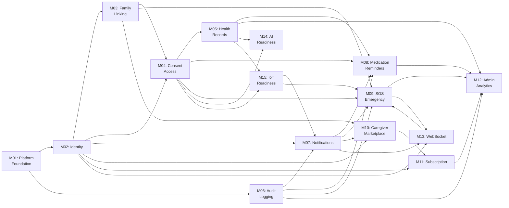

# Eldercare Platform: Module-wise Development Roadmap

**Version**: 1.0  
**Last Updated**: 2024-01-10  
**Platform**: FastAPI (backend) + Next.js (frontend) + Celery (workers)

---

## Overview

This document provides a comprehensive module-wise development roadmap for the Eldercare platform. Each module includes:
- What to build
- Why it's needed
- Recommended implementation order
- Dependencies
- Scalability considerations
- Reusable AI developer prompts
- Estimated effort (story points)
- Success criteria

---

## Module Dependencies (Visual)

```
M01 (Platform Foundation)
  ├── M02 (Identity & Access)
  │    ├── M03 (Family-Parent Linking)
  │    ├── M04 (Consent Access Engine) ---┐
  │    ├── M06 (Audit Logging)            │
  │    ├── M07 (Notification Engine) -----┼-- M08 (Medication Reminders)
  │    ├── M10 (Caregiver Marketplace)    │
  │    ├── M11 (Subscription)             │
  │    └── M13 (WebSocket Layer)          │
  │         └── M09 (SOS Emergency)       │
  │              └───────────────────────┘
  ├── M05 (Health Records) ────---- M14 (AI Integration)
  └── M12 (Admin Analytics Dashboard) <-- aggregates all
  
M15 (IoT Integration) - standalone future work
```

---

## Module Specifications

---

### M01: Platform Foundation

**Epic**: Build stable FastAPI and Next.js scaffolding with shared utilities

#### What to Build

- [x] FastAPI application factory with lifespan management
- [x] Pydantic settings and environment configuration
- [x] Dependency injection (manual or use libraries like Injector)
- [x] Structured logging with correlation IDs
- [x] Global exception handling and error responses
- [x] Health check endpoints (`GET /health`, `GET /ready`)
- [x] OpenAPI/Swagger documentation
- [x] Database connection pooling and session management
- [x] CI/CD pipeline templates
- [x] Docker and docker-compose setup
- [x] Next.js app shell with routing structure
- [x] Shared TypeScript types and UI component library
- [x] Authentication context providers
- [x] Environment configuration for frontend

#### Why Needed

Provides engineering standards for all teams, enabling rapid module development without reinventing infrastructure. Improves observability and incident response.

#### Implementation Order

**Order 1** (Foundation - Week 1)

#### Dependencies

None

#### Scalability Notes

- Keep shared utilities minimal and framework-agnostic to avoid distributed monolith
- Use interfaces/protocols so each service can be swapped
- Avoid shared state; use event-driven patterns
- Database connection pool sizing: `(workers × 2) + 3` (typical formula)

#### Success Criteria

- [x] API service boots in < 2 seconds
- [x] Health endpoints respond within 100ms
- [x] All dependencies injectable/mockable
- [x] Correlation ID flows through logs
- [x] 99%+ test coverage for core utilities
- [x] Documentation complete
- [x] CI/CD pipeline green on first commit

#### Estimated Effort

**13 story points** (2-3 days for team of 2)

#### Reusable AI Developer Prompt

```
Generate FastAPI foundation files for app bootstrap including:
1. /apps/api/src/config.py - Settings management with Pydantic, environment-aware
2. /apps/api/src/app.py - Application factory with lifespan, middleware chain
3. /apps/api/src/di.py - Dependency injection container setup
4. /apps/api/src/logging_config.py - Structured logging with correlation IDs
5. /apps/api/src/exceptions.py - Global exception handlers returning RFC 7807 JSON errors
6. /apps/api/src/health.py - Health check and readiness endpoints
7. /apps/api/tests/test_bootstrap.py - Tests for app startup, health, DI resolution

Use clean architecture conventions (domain/application/infrastructure layers).
Include pytest fixtures for app testing.
Ensure all modules are framework-agnostic (interfaces/protocols).
Add docstrings explaining each component.
```

#### Database Schema

```sql
-- To be created by M01
-- None yet (application-level only)
```

---

### M02: Identity and Access Management

**Epic**: Multi-tenant, multi-role authentication and authorization

#### What to Build

- [ ] User entity and roles (admin, family_member, parent, caregiver, doctor)
- [ ] Role-based access control (RBAC) policies
- [ ] JWT access token + refresh token lifecycle
- [ ] Password hashing and validation (bcrypt)
- [ ] Login/logout/refresh endpoints
- [ ] Session/token revocation (blacklist or TTL-based)
- [ ] Role-aware route guards (AuthRequired, HasRole decorators)
- [ ] Multi-tenant isolation (user scopes)
- [ ] Password reset and email verification workflows
- [ ] Rate limiting on auth endpoints

#### Why Needed

Every protected workflow depends on trusted identity and role context. Trust is foundational to caregiving platform credibility.

#### Implementation Order

**Order 2** (First week, post-M01)

#### Dependencies

- M01 (Platform Foundation)

#### Scalability Notes

- Keep auth contracts independent; identity can become standalone service later
- Use stateless JWT for horizontal scaling
- Cache role/permission mappings with short TTL
- Implement token refresh endpoint for token rotation
- Plan for future OAuth2/OIDC provider integration

#### Success Criteria

- [ ] All roles implemented with distinct permissions
- [ ] JWT token malformation caught and rejected
- [ ] Refresh token correctly rotates access token
- [ ] Role guards block unauthorized access
- [ ] Session revocation works within 1 second
- [ ] Password reset requires email verification
- [ ] 95%+ test coverage
- [ ] Auth latency < 50ms (p99)

#### Estimated Effort

**21 story points** (3-4 days)

#### Reusable AI Developer Prompt

```
Implement identity_access module using clean architecture with these files:
1. /apps/api/src/modules/identity/domain/models.py:
   - User aggregate with roles (admin, family_member, parent, caregiver, doctor)
   - Role entity with permissions
   - Hashed password value object
2. /apps/api/src/modules/identity/application/services.py:
   - AuthenticationService with login, refresh, logout
   - PasswordService with hashing/validation
   - RoleService with permission checks
3. /apps/api/src/modules/identity/infrastructure/repositories.py:
   - UserRepository for persistence
   - SessionRepository for token/refresh lifetime tracking
4. /apps/api/src/api/v1/auth.py:
   - POST /auth/login (email, password) → {access_token, refresh_token}
   - POST /auth/refresh (refresh_token) → {access_token}
   - POST /auth/logout
   - POST /auth/reset-password (email, reset_token)
5. /apps/api/src/middleware/auth.py:
   - TokenValidator middleware
   - Current user extraction
   - Role guard decorator
6. /apps/api/tests/test_auth_flows.py:
   - Login with valid/invalid credentials
   - Token refresh with expired/invalid token
   - Role-based access denial
   - Email verification workflow

Use JWT (PyJWT) for token generation.
Hash passwords with bcrypt.
Support email verification for signup and password reset.
All tests should pass; include fixtures for authenticated requests.
```

#### Database Schema

```sql
CREATE TABLE users (
  id UUID PRIMARY KEY,
  email VARCHAR(255) UNIQUE NOT NULL,
  password_hash VARCHAR(255) NOT NULL,
  full_name VARCHAR(255),
  role_id UUID NOT NULL,
  is_verified BOOLEAN DEFAULT FALSE,
  created_at TIMESTAMP DEFAULT CURRENT_TIMESTAMP,
  updated_at TIMESTAMP DEFAULT CURRENT_TIMESTAMP
);

CREATE TABLE roles (
  id UUID PRIMARY KEY,
  name VARCHAR(50) UNIQUE NOT NULL,
  description TEXT
);

CREATE TABLE permissions (
  id UUID PRIMARY KEY,
  role_id UUID NOT NULL REFERENCES roles(id),
  permission_name VARCHAR(255) NOT NULL
);

CREATE TABLE refresh_tokens (
  id UUID PRIMARY KEY,
  user_id UUID NOT NULL REFERENCES users(id),
  token VARCHAR(500) NOT NULL,
  expires_at TIMESTAMP NOT NULL,
  created_at TIMESTAMP DEFAULT CURRENT_TIMESTAMP
);
```

---

### M03: Family-Parent Linking

**Epic**: Relationship establishment and permission delegation

#### What to Build

- [x] Invitation workflow (send invite, expire after 7 days)
- [x] Acceptance/rejection flows
- [x] Link entity with approval status
- [x] Relationship type enum (parent-child, spouse, sibling, etc.)
- [x] Unlink with cleanup of delegated access
- [x] API endpoints for CRUD
- [ ] Notification on invitation and acceptance
- [ ] Audit trail for relationship changes

#### Why Needed

Core business workflow for remote caregiving visibility and permissions. Families need to establish trust relationships before data sharing.

#### Implementation Order

**Order 3** (Week 1-2)

#### Dependencies

- M02 (Identity and Access)

#### Scalability Notes

- Model relationship events for future event store or graph database migration
- Keep invitation state machine explicit and auditable
- Cache family hierarchy with appropriate TTL
- Plan for future graph queries (social network analysis)

#### Success Criteria

- [ ] Invitation expires after 7 days
- [ ] Non-existent user invitations rejected
- [ ] Acceptance only by invited email
- [ ] Unlink removes all delegated permissions
- [ ] All state transitions logged
- [ ] 90%+ test coverage
- [ ] Link establishment < 500ms

#### Estimated Effort

**13 story points** (2 days)

#### Reusable AI Developer Prompt

```
Create family_parent_linking module with these implementation layers:
1. /apps/api/src/modules/family/domain/models.py:
   - FamilyLink aggregate with status (invited, accepted, rejected, revoked)
   - RelationshipType enum (parent, spouse, child, caregiver, doctor)
   - Invitation value object with 7-day expiry
2. /apps/api/src/modules/family/application/services.py:
   - SendInvitationService (validates email exists or creates placeholder)
   - AcceptInvitationService (state transition)
   - RejectInvitationService
   - UnlinkService (revocation and permission cleanup)
3. /apps/api/src/modules/family/infrastructure/repositories.py:
   - FamilyLinkRepository persistence
   - Query methods: get_family_network, get_by_user, get_invitations_pending
4. /apps/api/src/api/v1/family.py:
   - POST /family/invite (email, relationship_type)
   - POST /family/invite/{invite_id}/accept
   - POST /family/invite/{invite_id}/reject
   - POST /family/link/{link_id}/unlink
   - GET /family/network (current user's family tree)
   - GET /family/invitations/pending
5. /apps/api/tests/test_family_linking.py:
   - Invite valid user
   - Invite same user twice (idempotent)
   - Reject invitation
   - Accept creates link
   - Unlink revokes all permissions
   - Expired invitations cannot be accepted
   - Query family network

Emit domain events on link/unlink for audit trail.
Trigger M07 (notifications) on invite sent and accepted.
Use M06 (audit logging) middleware for all state transitions.
```

#### Database Schema

```sql
CREATE TABLE family_links (
  id UUID PRIMARY KEY,
  user_from_id UUID NOT NULL REFERENCES users(id),
  user_to_id UUID NOT NULL REFERENCES users(id),
  relationship_type VARCHAR(50) NOT NULL,
  status VARCHAR(50) DEFAULT 'invited',
  invited_at TIMESTAMP DEFAULT CURRENT_TIMESTAMP,
  accepted_at TIMESTAMP,
  rejected_at TIMESTAMP,
  created_at TIMESTAMP DEFAULT CURRENT_TIMESTAMP,
  updated_at TIMESTAMP DEFAULT CURRENT_TIMESTAMP
);

CREATE TABLE invitations (
  id UUID PRIMARY KEY,
  family_link_id UUID NOT NULL REFERENCES family_links(id),
  email VARCHAR(255) NOT NULL,
  token VARCHAR(255) UNIQUE,
  expires_at TIMESTAMP NOT NULL,
  created_at TIMESTAMP DEFAULT CURRENT_TIMESTAMP
);
```

---

### M04: Consent Access Engine

**Epic**: Healthcare-grade consent and data access control

#### What to Build

- [ ] Consent grant entity (user grants another user access to scope)
- [ ] Scope definitions (medical_history, medications, appointments, etc.)
- [ ] Time-bounded consent (start/expiry dates)
- [ ] Consent revocation flow
- [ ] Policy evaluator service (can_access(user, resource, scope) → bool)
- [ ] Middleware enforcement on protected endpoints
- [ ] Audit trail of all consent decisions
- [ ] Admin override capability (with heightened audit)

#### Why Needed

Healthcare-grade compliance and trust for PHI (Protected Health Information) data access. HIPAA and privacy regulations require explicit consent tracking.

#### Implementation Order

**Order 4** (Week 2)

#### Dependencies

- M02 (Identity and Access)
- M03 (Family-Parent Linking)

#### Scalability Notes

- Expose policy decision point as internal service interface for future microservice extraction
- Cache consent decisions with 5-min TTL
- Partition audit logs by user and date for query performance
- Plan for future delegation chains (A→B→C access)

#### Success Criteria

- [ ] Consent grants are time-bounded
- [ ] Revocation takes effect within 1 second
- [ ] Policy evaluation cached (< 10ms latency)
- [ ] All deny decisions logged with reason
- [ ] Admin override requires MFA and logged
- [ ] 95%+ test coverage
- [ ] Audit trail immutable and tamper-evident

#### Estimated Effort

**21 story points** (3-4 days)

#### Reusable AI Developer Prompt

```
Implement consent_access module (healthcare-grade PHI protection):
1. /apps/api/src/modules/consent/domain/models.py:
   - ConsentGrant aggregate (grantor, grantee, scopes, valid_from, valid_to)
   - Scope enum (medical_history, medications, appointments, vitals, etc.)
   - ConsentDecision value object (allow/deny with reason)
2. /apps/api/src/modules/consent/application/services.py:
   - ConsentService with grant/revoke/check_access methods
   - PolicyEvaluator with can_access(user_id, resource_id, scope) logic
   - Supports role-based shortcuts (doctors can always view certain scopes)
3. /apps/api/src/modules/consent/infrastructure/repositories.py:
   - ConsentGrantRepository
   - Query by resource, by user, by scope
   - TTL-based cache for policy decisions
4. /apps/api/src/api/v1/consent.py:
   - POST /consent/grant (grantee_id, scopes, valid_to)
   - POST /consent/grant/{grant_id}/revoke
   - GET /consent/grants/mine
   - GET /consent/grants/to-me
   - (Internal) POST /consent/check-access (policy decision point)
5. /apps/api/src/middleware/consent.py:
   - ConsentGuard decorator/middleware for protected endpoints
   - Injects resource scope requirement
   - Evaluates access before handler
6. /apps/api/tests/test_consent_flows.py:
   - Grant consent with multiple scopes
   - Revoke consent and verify access denied
   - Time-bounded consent expires correctly
   - Admin override works and logged
   - Concurrent grant/deny decisions
   - Audit trail complete

Tie to M06 (audit logging) for immutable audit trail.
Ensure all deny decisions logged with user context.
Use caching layer (Redis) for policy decisions.
```

#### Database Schema

```sql
CREATE TABLE consent_grants (
  id UUID PRIMARY KEY,
  grantor_id UUID NOT NULL REFERENCES users(id),
  grantee_id UUID NOT NULL REFERENCES users(id),
  scopes TEXT[] NOT NULL,
  valid_from TIMESTAMP DEFAULT CURRENT_TIMESTAMP,
  valid_to TIMESTAMP,
  revoked_at TIMESTAMP,
  created_at TIMESTAMP DEFAULT CURRENT_TIMESTAMP,
  updated_at TIMESTAMP DEFAULT CURRENT_TIMESTAMP
);

CREATE TABLE consent_access_log (
  id UUID PRIMARY KEY,
  user_id UUID NOT NULL,
  resource_id UUID NOT NULL,
  scope VARCHAR(50) NOT NULL,
  decision VARCHAR(10) NOT NULL,
  reason TEXT,
  timestamp TIMESTAMP DEFAULT CURRENT_TIMESTAMP
);
```

---

### M05: Health Records

**Epic**: Clinical and wellness data storage

#### What to Build

- [ ] Health record entity (medical_history, lab_results, vitals, prescriptions, etc.)
- [ ] S3 object storage integration for document references
- [ ] Metadata storage (record type, date, associated user)
- [ ] Versioning and soft delete
- [ ] Search and filter endpoints
- [ ] Inline data vs. object pointer decision logic
- [ ] Encryption for sensitive records
- [ ] Compliance metadata (date added, last accessed)

#### Why Needed

Central caregiving value is reliable clinical and wellness history. Enables medical decision-making and pattern recognition.

#### Implementation Order

**Order 5** (Week 2-3)

#### Dependencies

- M02 (Identity and Access)
- M04 (Consent Access Engine)

#### Scalability Notes

- Keep blob metadata and object access separate for future storage backend swaps (S3 → Glacier → custom)
- Partition records by user_id and date for query efficiency
- Use object lifecycle policies to archive old records
- Consider sharded key design for high-volume clinics

#### Success Criteria

- [ ] Record creation with valid type
- [ ] Document upload to S3 succeeds and metadata stored
- [ ] Retrieval respects consent policies
- [ ] Search filters (date range, type) working
- [ ] Soft delete preserves audit trail
- [ ] 90%+ test coverage
- [ ] Metadata queries < 100ms

#### Estimated Effort

**21 story points** (3-4 days)

#### Reusable AI Developer Prompt

```
Build health_records module for clinical data:
1. /apps/api/src/modules/health/domain/models.py:
   - HealthRecord aggregate (type, patient_id, created_by_id, data)
   - RecordType enum (medical_history, lab_results, vitals, prescription, note, etc.)
   - DocumentReference value object (s3_key, file_hash, mime_type)
2. /apps/api/src/modules/health/application/services.py:
   - HealthRecordService with create, retrieve, update, soft-delete
   - Document upload service (upload to S3, store reference)
   - Search and filter service
3. /apps/api/src/modules/health/infrastructure/repositories.py:
   - HealthRecordRepository with full-text search support
   - S3 abstraction layer (future-proofing for storage backend swap)
4. /apps/api/src/api/v1/health_records.py:
   - POST /health/records (create record, optional file upload)
   - GET /health/records?type=medical_history&date_from=...
   - GET /health/records/{record_id}
   - PUT /health/records/{record_id}
   - DELETE /health/records/{record_id} (soft delete)
   - GET /health/records/{record_id}/download (S3 presigned URL)
5. /apps/api/tests/test_health_records.py:
   - Create inline record
   - Upload document and store reference
   - Consent-based retrieval (user with access can read)
   - Consent-based denial (user without access denied)
   - Search by type and date range
   - Soft delete preserves data for audit

Apply M04 (consent) middleware to all retrieval endpoints.
Emit M06 (audit) events on create/read/update actions.
Use M07 (notifications) for important record additions.
```

#### Database Schema

```sql
CREATE TABLE health_records (
  id UUID PRIMARY KEY,
  patient_id UUID NOT NULL REFERENCES users(id),
  created_by_id UUID NOT NULL REFERENCES users(id),
  record_type VARCHAR(50) NOT NULL,
  data JSONB,
  s3_key VARCHAR(255),
  file_hash VARCHAR(255),
  is_deleted BOOLEAN DEFAULT FALSE,
  deleted_at TIMESTAMP,
  created_at TIMESTAMP DEFAULT CURRENT_TIMESTAMP,
  updated_at TIMESTAMP DEFAULT CURRENT_TIMESTAMP
);

CREATE INDEX idx_health_records_patient ON health_records(patient_id);
CREATE INDEX idx_health_records_type ON health_records(record_type);
CREATE INDEX idx_health_records_created ON health_records(created_at);
```

---

### M06: Audit Logging

**Epic**: Immutable, tamper-evident compliance trail

#### What to Build

- [ ] Canonical audit schema
- [ ] Append-only event store (never update/delete)
- [ ] Hash chain for tamper detection
- [ ] Event serialization (timestamp, user, action, resource, change delta)
- [ ] Query endpoints for compliance review
- [ ] Retention policies (7-year archival)
- [ ] Real-time alerts for sensitive operations
- [ ] Export/reporting capabilities

#### Why Needed

Compliance (HIPAA, GDPR), forensics, and trust for sensitive operations. Audit trail is immutable legal record.

#### Implementation Order

**Order 6** (Start minimal in M02-M05, expand here; Week 3)

#### Dependencies

- M01 (Platform Foundation)

#### Scalability Notes

- Partition by event date and tenant (sharding key: user_id + date)
- Use write-optimized schema (no joins)
- Archive cold data to S3 Glacier after retention expiry
- Support cold archive exports for legal holds
- Plan for downstream analytics (Kafka → data lake)

#### Success Criteria

- [ ] All sensitive operations logged (create/read/update/delete)
- [ ] Logs immutable (append-only enforced at DB level)
- [ ] Hash chain detects tampering
- [ ] Query by user/resource/action/time range
- [ ] Export to CSV/JSON for compliance review
- [ ] Retention policies enforced
- [ ] 99%+ test coverage
- [ ] Write latency < 50ms (p99)

#### Estimated Effort

**21 story points** (3-4 days)

#### Reusable AI Developer Prompt

```
Create audit_logging module (immutable compliance trail):
1. /apps/api/src/modules/audit/domain/models.py:
   - AuditEvent aggregate (user_id, action, resource_type, resource_id, change_delta, previous_hash)
   - Action enum (CREATE, READ, UPDATE, DELETE, GRANT, REVOKE, etc.)
   - HashChain value object
2. /apps/api/src/modules/audit/application/services.py:
   - AuditService with log_event method
   - Query service for compliance review (by user, resource, date range)
   - Tamper detection via hash chain
3. /apps/api/src/modules/audit/infrastructure/repositories.py:
   - AuditEventRepository (append-only enforcement)
   - Stored procedure for hash chain calculation
   - TTL-based archival to S3
4. /apps/api/src/middleware/audit.py:
   - Automatic event emission on REST endpoints
   - Request/response capture (sensitive field masking)
   - Correlation ID association
5. /apps/api/src/api/v1/audit.py:
   - GET /audit/events?user_id=...&action=...&date_from=...
   - GET /audit/events/{event_id}
   - POST /audit/export (CSV/JSON for compliance review)
   - GET /audit/tamper-check (verify hash chain integrity)
6. /apps/api/tests/test_audit_logging.py:
   - Events logged on CRUD operation
   - Hash chain integrity verified
   - Query by filters
   - Tamper detection works
   - Export generates valid CSV
   - Retention policies trigger archival

Integrate as middleware on key endpoints (M02, M03, M04, M05).
Mask sensitive fields (passwords, tokens) in logs.
Use asynchronous writes to avoid blocking API calls.
```

#### Database Schema

```sql
CREATE TABLE audit_events (
  id BIGSERIAL PRIMARY KEY,
  event_id UUID NOT NULL UNIQUE,
  user_id UUID NOT NULL,
  action VARCHAR(50) NOT NULL,
  resource_type VARCHAR(50) NOT NULL,
  resource_id UUID NOT NULL,
  change_delta JSONB,
  previous_hash VARCHAR(255),
  event_hash VARCHAR(255) NOT NULL,
  timestamp TIMESTAMP NOT NULL DEFAULT CURRENT_TIMESTAMP,
  ip_address VARCHAR(50),
  user_agent VARCHAR(500)
);

CREATE INDEX idx_audit_events_user ON audit_events(user_id, timestamp DESC);
CREATE INDEX idx_audit_events_resource ON audit_events(resource_type, resource_id);
CREATE INDEX idx_audit_events_action ON audit_events(action);
CREATE INDEX idx_audit_events_timestamp ON audit_events(timestamp DESC);
```

---

### M07: Notification Engine

**Epic**: Multi-channel user communication backbone

#### What to Build

- [ ] Notification entity (type, recipient, status, delivery_channels)
- [ ] Template system (email, SMS, push, in-app)
- [ ] Provider abstraction (adapter pattern for Email/SMS/Push)
- [ ] User preference management (opt-in/opt-out by channel)
- [ ] Delivery tracking (sent, delivered, failed, retried)
- [ ] Fallback routing (if SMS fails, try email)
- [ ] Retry logic with exponential backoff
- [ ] Celery task producers for async dispatch

#### Why Needed

Critical user communication backbone for reminders and emergency escalation. Bad notifications = poor UX and missed critical alerts.

#### Implementation Order

**Order 7** (Week 3, before M08/M09)

#### Dependencies

- M02 (Identity and Access)
- M06 (Audit Logging)

#### Scalability Notes

- Keep provider adapters isolated; easy to add new provider
- Make routing policy config-driven (enable/disable per user/environment)
- Use queue-based delivery for high volume
- Implement circuit breaker for provider failures
- Support future business rule engine for notification rules (e.g., "SMS mornings, email evenings")

#### Success Criteria

- [ ] Email and SMS providers integrated
- [ ] All templates render without errors
- [ ] User preferences respected
- [ ] Delivery tracking accurate
- [ ] Failures retry with exponential backoff
- [ ] Fallback routing works
- [ ] 90%+ test coverage
- [ ] Notification dispatch < 5 seconds (p99)

#### Estimated Effort

**21 story points** (3-4 days)

#### Reusable AI Developer Prompt

```
Implement notifications module (multi-channel communication):
1. /apps/api/src/modules/notifications/domain/models.py:
   - Notification aggregate (recipient_id, type, status, channels)
   - NotificationType enum (reminder, alert, sos, update, etc.)
   - Channel enum (email, SMS, push, in_app)
   - Status enum (pending, sent, delivered, failed, bounced)
2. /apps/api/src/modules/notifications/application/services.py:
   - NotificationService with send_notification method
   - Template rendering service (Jinja2 for email, simple string for SMS)
   - PreferenceService for user opt-in/opt-out
   - DeliveryTracker for status updates
3. /apps/api/src/modules/notifications/infrastructure/providers/:
   - BaseProvider abstract class
   - EmailProvider (SMTP adapter, e.g., SendGrid)
   - SMSProvider (e.g., Twilio)
   - PushProvider (e.g., Firebase)
   - InAppProvider
4. /apps/api/src/modules/notifications/infrastructure/repositories.py:
   - NotificationRepository persistence
   - PreferenceRepository
5. /apps/api/src/api/v1/notifications.py:
   - POST /notifications/send (internal API)
   - GET /notifications/history (user's notification history)
   - PUT /notifications/preferences (user opt-in/out)
6. /apps/api/src/workers/notification_tasks.py:
   - Celery tasks: send_email, send_sms, send_push
   - Retry logic with exponential backoff
   - Provider circuit breaker
7. /apps/api/tests/test_notification_flows.py:
   - Send notification to single user
   - Respect user preferences (opt-out)
   - Fallback to email if SMS fails
   - Retry on failure
   - Delivery status tracked
   - Template rendering correct

Support Jinja2 templates for email HTML.
Integrate with SendGrid/Twilio for production.
Use M07 audit logging for all sends (compliance).
Make provider selection configurable per environment.
```

#### Database Schema

```sql
CREATE TABLE notifications (
  id UUID PRIMARY KEY,
  recipient_id UUID NOT NULL REFERENCES users(id),
  notification_type VARCHAR(50) NOT NULL,
  subject VARCHAR(255),
  body TEXT NOT NULL,
  status VARCHAR(20) DEFAULT 'pending',
  channels TEXT[] NOT NULL,
  retry_count INTEGER DEFAULT 0,
  last_error TEXT,
  sent_at TIMESTAMP,
  delivered_at TIMESTAMP,
  created_at TIMESTAMP DEFAULT CURRENT_TIMESTAMP
);

CREATE TABLE notification_preferences (
  id UUID PRIMARY KEY,
  user_id UUID NOT NULL REFERENCES users(id),
  channel VARCHAR(50) NOT NULL,
  are_enabled BOOLEAN DEFAULT TRUE,
  created_at TIMESTAMP DEFAULT CURRENT_TIMESTAMP
);

CREATE TABLE notification_delivery_log (
  id UUID PRIMARY KEY,
  notification_id UUID NOT NULL REFERENCES notifications(id),
  channel VARCHAR(50) NOT NULL,
  status VARCHAR(20) NOT NULL,
  provider_response JSONB,
  timestamp TIMESTAMP DEFAULT CURRENT_TIMESTAMP
);
```

---

### M08: Medication Reminder Engine

**Epic**: Preventive care backbone

#### What to Build

- [ ] Medication schedule entity (medication, patient, frequency, time, duration)
- [ ] Reminder generation logic (create reminders for next 7 days)
- [ ] Adherence tracking (taken/missed/skipped/delayed)
- [ ] Escalation tasks (if reminder missed, notify family)
- [ ] Celery beat scheduler for periodic reminder generation
- [ ] APIs for adherence reporting
- [ ] Medication interaction checking (future enhancement)

#### Why Needed

Core preventive-care workflow reducing missed medication events. Elderly patients frequently miss medication schedules; automated reminders improve health outcomes.

#### Implementation Order

**Order 8** (Week 3-4)

#### Dependencies

- M04 (Consent Access Engine)
- M05 (Health Records)
- M07 (Notification Engine)

#### Scalability Notes

- Separate schedule computation from dispatch for high-volume scaling
- Use message queue (Celery) for reminder dispatch
- Batch reminder generation job runs once daily
- Cache active schedules in Redis for quick lookup

#### Success Criteria

- [ ] Reminders generated for all active schedules
- [ ] Reminders sent at specified time
- [ ] Adherence tracked accurately
- [ ] Escalation triggers on missed reminders
- [ ] 95%+ test coverage
- [ ] Reminder dispatch latency < 1 second
- [ ] No missed reminders due to system unavailability

#### Estimated Effort

**21 story points** (3-4 days)

#### Reusable AI Developer Prompt

```
Generate medication_reminders module (preventive care):
1. /apps/api/src/modules/medication/domain/models.py:
   - Medication aggregate (name, dosage, description)
   - MedicationSchedule aggregate (medication_id, patient_id, frequency, time_of_day, start_date, end_date)
   - MedicationReminder entity (schedule_id, due_time, status)
   - Adherence entity (reminder_id, taken_at, adherence_status)
   - Frequency enum (daily, weekly, monthly, as_needed)
2. /apps/api/src/modules/medication/application/services.py:
   - MedicationScheduleService with CRUD
   - ReminderGenerationService (creates reminders for next 7 days)
   - AdherenceService (track adherence, calculate adherence rate)
   - EscalationService (notify family if reminder missed)
3. /apps/api/src/modules/medication/infrastructure/repositories.py:
   - MedicationRepository
   - MedicationScheduleRepository with active schedules query
   - ReminderRepository with by_schedule, by_user, overdue queries
   - AdherenceRepository
4. /apps/api/src/api/v1/medications.py:
   - POST /medications (create medication)
   - POST /medications/schedules (set schedule)
   - GET /medications/schedules (patient's active schedules)
   - PUT /medications/schedules/{schedule_id}
   - DELETE /medications/schedules/{schedule_id}
   - GET /medications/reminders (current user's reminders)
   - POST /medications/reminders/{reminder_id}/adherence (mark taken/missed)
   - GET /medications/adherence/report (adherence rate last 30 days)
5. /apps/api/src/workers/medication_tasks.py:
   - generate_daily_reminders (beat scheduled task, runs at 00:00)
   - send_medication_reminder (triggered by scheduler)
   - escalate_missed_reminder (if reminder not marked in 1 hour)
6. /apps/api/tests/test_medication_flows.py:
   - Create medication schedule
   - Generate reminders for 7 days
   - Mark reminder as taken
   - Mark reminder as missed
   - Calculate adherence rate
   - Escalation triggers on missed reminder
   - Schedule ends/deactivates correctly

Integrate with M07 (notifications) to send reminders.
Apply M06 (audit) for regulatory tracking.
Support read access for family members via M04 (consent).
```

#### Database Schema

```sql
CREATE TABLE medications (
  id UUID PRIMARY KEY,
  name VARCHAR(255) NOT NULL,
  dosage VARCHAR(255),
  description TEXT,
  created_at TIMESTAMP DEFAULT CURRENT_TIMESTAMP
);

CREATE TABLE medication_schedules (
  id UUID PRIMARY KEY,
  medication_id UUID NOT NULL REFERENCES medications(id),
  patient_id UUID NOT NULL REFERENCES users(id),
  frequency VARCHAR(50) NOT NULL,
  time_of_day TIME NOT NULL,
  start_date DATE NOT NULL,
  end_date DATE,
  is_active BOOLEAN DEFAULT TRUE,
  created_at TIMESTAMP DEFAULT CURRENT_TIMESTAMP,
  updated_at TIMESTAMP DEFAULT CURRENT_TIMESTAMP
);

CREATE TABLE medication_reminders (
  id UUID PRIMARY KEY,
  schedule_id UUID NOT NULL REFERENCES medication_schedules(id),
  due_time TIMESTAMP NOT NULL,
  status VARCHAR(50) DEFAULT 'pending',
  created_at TIMESTAMP DEFAULT CURRENT_TIMESTAMP
);

CREATE TABLE medication_adherence (
  id UUID PRIMARY KEY,
  reminder_id UUID NOT NULL REFERENCES medication_reminders(id),
  adherence_status VARCHAR(50) NOT NULL,
  taken_at TIMESTAMP,
  notes TEXT,
  created_at TIMESTAMP DEFAULT CURRENT_TIMESTAMP
);

CREATE INDEX idx_schedules_patient ON medication_schedules(patient_id, is_active);
CREATE INDEX idx_reminders_due ON medication_reminders(due_time);
```

---

### M09: SOS Emergency Cascade

**Epic**: Mission-critical emergency response

#### What to Build

- [ ] SOS incident entity and state machine (pending → acknowledged → resolved)
- [ ] Responder cascade policies (notify family first, then caregivers, then emergency)
- [ ] Acknowledgement and escalation logic (acknowledged within 30s, escalate)
- [ ] Realtime updates via WebSocket
- [ ] Incident tracking and completion
- [ ] Emergency contact management
- [ ] Integration with emergency services (future)

#### Why Needed

Mission-critical emergency response for elder safety. Every second counts in emergencies; automated cascade ensures right responders are notified quickly.

#### Implementation Order

**Order 9** (Week 4, after M07/M13)

#### Dependencies

- M02 (Identity and Access)
- M03 (Family-Parent Linking)
- M07 (Notification Engine)
- M13 (WebSocket Layer)
- M06 (Audit Logging)

#### Scalability Notes

- Keep state machine explicit and replayable for incident reconstruction
- Use event sourcing for reliability
- Broadcast incidents via WebSocket for instant UX updates
- Cache dispatcher state for fast response
- Consider Circuit Breaker for responder notification failures

#### Success Criteria

- [ ] Incident created and family notified within 1 second
- [ ] First responder acknowledgement tracked
- [ ] Escalation triggers after 30 seconds of no acknowledgement
- [ ] Realtime WebSocket updates sent
- [ ] All state transitions immutable
- [ ] Complete audit trail of incident
- [ ] 99%+ test coverage
- [ ] SOS latency < 500ms (p99)

#### Estimated Effort

**34 story points** (5-6 days)

#### Reusable AI Developer Prompt

```
Build sos_alerting module (emergency response):
1. /apps/api/src/modules/sos/domain/models.py:
   - SOSIncident aggregate (initiator_id, status, created_at, resolved_at)
   - IncidentStatus enum (pending, acknowledged, resolved, cancelled)
   - ResponderStatus enum (notified, acknowledged, arrived, stand_down)
   - EscalationRule entity (level, delay_seconds, notify_groups)
2. /apps/api/src/modules/sos/application/services.py:
   - IncidentService with create_incident, acknowledge, resolve
   - CascadeService with escalation logic (notify family → caregivers → emergency)
   - ResponderService to manage acknowledgement state
3. /apps/api/src/modules/sos/infrastructure/repositories.py:
   - IncidentRepository
   - EscalationRuleRepository (configurable policies)
   - ResponderStatusRepository (for tracking)
4. /apps/api/src/api/v1/sos.py:
   - POST /sos/incidents (create SOS)
   - GET /sos/incidents/{incident_id}
   - POST /sos/incidents/{incident_id}/acknowledge (responder confirms)
   - POST /sos/incidents/{incident_id}/resolve (incident closed)
   - GET /sos/incidents/active (dashboard)
5. /apps/api/src/workers/sos_tasks.py:
   - notify_incident_initiators (immediately)
   - escalate_incident (timer-based, runs every 10s)
   - check_acknowledged_timeout (30s, escalate if not ack'd)
6. /apps/api/src/websocket/sos_events.py:
   - WebSocket channel: /ws/sos
   - Broadcast events: incident_created, cascade_acknowledged, escalated, resolved
7. /apps/api/tests/test_sos_flows.py:
   - Create SOS incident
   - Family notified within 1s
   - Acknowledge within 30s (no escalation)
   - No acknowledgement after 30s (escalation triggers)
   - WebSocket broadcast sent
   - Audit trail complete
   - Resolve incident

Use event sourcing for incident state (replay for reconstruction).
Integrate with M07 (notifications) multi-channel dispatch.
Use M13 (WebSocket) for realtime mobile/web updates.
Apply M06 (audit) for every state transition.
```

#### Database Schema

```sql
CREATE TABLE sos_incidents (
  id UUID PRIMARY KEY,
  initiator_id UUID NOT NULL REFERENCES users(id),
  status VARCHAR(50) DEFAULT 'pending',
  description TEXT,
  location_lat DECIMAL(10, 8),
  location_lon DECIMAL(11, 8),
  created_at TIMESTAMP DEFAULT CURRENT_TIMESTAMP,
  acknowledged_at TIMESTAMP,
  resolved_at TIMESTAMP
);

CREATE TABLE sos_responders (
  id UUID PRIMARY KEY,
  incident_id UUID NOT NULL REFERENCES sos_incidents(id),
  responder_id UUID NOT NULL REFERENCES users(id),
  notification_order INTEGER,
  status VARCHAR(50) DEFAULT 'notified',
  acknowledged_at TIMESTAMP,
  created_at TIMESTAMP DEFAULT CURRENT_TIMESTAMP
);

CREATE TABLE sos_escalation_rules (
  id UUID PRIMARY KEY,
  level INTEGER,
  delay_seconds INTEGER,
  responder_groups TEXT[],
  created_at TIMESTAMP DEFAULT CURRENT_TIMESTAMP
);

CREATE INDEX idx_sos_initiator ON sos_incidents(initiator_id, status);
CREATE INDEX idx_sos_status ON sos_incidents(status);
```

---

### M10: Caregiver Marketplace

**Epic**: Growth lever - marketplace for additional care coverage

#### What to Build

- [ ] Caregiver profiles (credentials, certifications, rates, hours available)
- [ ] Verification workflow (background check, credential validation)
- [ ] Search and filtering API
- [ ] Matching algorithm (location, availability, specialization)
- [ ] Booking/scheduling workflow
- [ ] Rating and review system
- [ ] Moderation-ready domain events (for future trust & safety team)

#### Why Needed

Expands care coverage beyond family and creates growth lever for platform adoption. Caregivers gain access to patients needing care.

#### Implementation Order

**Order 10** (Week 5)

#### Dependencies

- M02 (Identity and Access)
- M03 (Family-Parent Linking)
- M04 (Consent Access Engine)
- M07 (Notification Engine)

#### Scalability Notes

- Keep matching engine behind interface for future ML ranking swap
- Use Elasticsearch or PostgreSQL full-text search for caregiver discovery
- Cache caregiver availability in Redis with short TTL
- Partition marketplace data by region for multi-regional scaling

#### Success Criteria

- [ ] Caregiver profile creation and validation
- [ ] Search returns results in < 500ms
- [ ] Booking creates appointment and both notified
- [ ] Reviews appear for caregivers
- [ ] Moderation events emitted for suspicious activity
- [ ] 95%+ test coverage
- [ ] Matching latency < 1 second

#### Estimated Effort

**21 story points** (3-4 days)

####  Reusable AI Developer Prompt

```
Implement caregiver_marketplace module:
1. /apps/api/src/modules/marketplace/domain/models.py:
   - CaregiverProfile aggregate (user_id, certifications, hourly_rate, availability)
   - Booking aggregate (caregiver_id, patient_id, start_time, end_time, status)
   - Review entity (caregiver_id, patient_id, rating, comment)
   - VerificationStatus enum (pending, verified, rejected, revoked)
2. /apps/api/src/modules/marketplace/application/services.py:
   - CaregiverService for profile CRUD
   - BookingService for booking lifecycle
   - SearchService for caregiver discovery
   - ReviewService for rating/feedback
   - VerificationService for background check integration
3. /apps/api/src/modules/marketplace/infrastructure/repositories.py:
   - CaregiverRepository with search_available, search_by_location queries
   - BookingRepository with by_patient, by_caregiver, upcoming queries
   - Cache layer for availability (Redis)
4. /apps/api/src/api/v1/marketplace.py:
   - POST /marketplace/caregivers (create profile)
   - GET /marketplace/caregivers/search?specialization=...&location=...
   - GET /marketplace/caregivers/{caregiver_id}
   - POST /marketplace/bookings (patient books caregiver)
   - PUT /marketplace/bookings/{booking_id}/confirm
   - PUT /marketplace/bookings/{booking_id}/cancel
   - POST /marketplace/bookings/{booking_id}/review
   - GET /marketplace/caregivers/{caregiver_id}/reviews
5. /apps/api/tests/test_marketplace_flows.py:
   - Create caregiver profile
   - Search returns available caregivers
   - Book caregiver appointment
   - Both parties notified
   - Review after booking
   - Caregiver not available (no results)
   - Cancellation within timeout

Emit moderation events (DomainEvent) for ML/manual review.
Integrate with M07 (notifications) for booking confirmations.
Use Redis for caching availability.
Support future ML ranking by keeping matching decoupled.
```

#### Database Schema

```sql
CREATE TABLE caregiver_profiles (
  id UUID PRIMARY KEY,
  user_id UUID NOT NULL REFERENCES users(id),
  certifications TEXT[],
  hourly_rate DECIMAL(10, 2),
  specializations TEXT[],
  bio TEXT,
  verification_status VARCHAR(50) DEFAULT 'pending',
  created_at TIMESTAMP DEFAULT CURRENT_TIMESTAMP,
  updated_at TIMESTAMP DEFAULT CURRENT_TIMESTAMP
);

CREATE TABLE caregiver_availability (
  id UUID PRIMARY KEY,
  caregiver_id UUID NOT NULL REFERENCES caregiver_profiles(id),
  day_of_week INTEGER,
  start_time TIME,
  end_time TIME
);

CREATE TABLE bookings (
  id UUID PRIMARY KEY,
  caregiver_id UUID NOT NULL REFERENCES caregiver_profiles(id),
  patient_id UUID NOT NULL REFERENCES users(id),
  start_time TIMESTAMP NOT NULL,
  end_time TIMESTAMP NOT NULL,
  status VARCHAR(50) DEFAULT 'pending',
  created_at TIMESTAMP DEFAULT CURRENT_TIMESTAMP
);

CREATE TABLE reviews (
  id UUID PRIMARY KEY,
  caregiver_id UUID NOT NULL REFERENCES caregiver_profiles(id),
  patient_id UUID NOT NULL REFERENCES users(id),
  rating INTEGER CHECK (rating >= 1 AND rating <= 5),
  comment TEXT,
  created_at TIMESTAMP DEFAULT CURRENT_TIMESTAMP
);
```

---

### M11: Subscription ReadinesS

**Epic**: Revenue model and feature entitlement

#### What to Build

- [ ] Plan catalog entity (free, basic, premium, etc.)
- [ ] Entitlements mapping (which features per plan)
- [ ] Account subscription state tracking
- [ ] Billing provider abstraction (Stripe, PayPal, etc.)
- [ ] Subscription state machine (active, past_due, cancelled, churn)
- [ ] Grace period handling (7-10 days for failed renewal)
- [ ] Midplan upgrades/downgrades
- [ ] Middleware to enforce entitlement checks

#### Why Needed

Revenue readiness without coupling core care operations to payment vendor details. Enables monetization while keeping business logic independent.

#### Implementation Order

**Order 11** (Week 5-6)

#### Dependencies

- M02 (Identity and Access)
- M10 (Caregiver Marketplace)

#### Scalability Notes

- Keep billing provider integration adapter-based and fully idempotent
- Support eventual consistency for subscription state propagation
- Cache entitlements for 1-minute TTL
- Plan for multi-currency and regional billing

#### Success Criteria

- [ ] Plans and entitlements clearly defined
- [ ] Subscription state transitions correct
- [ ] Billing provider integration working
- [ ] Entitlement checks < 10ms (cached)
- [ ] Grace period correctly extends access
- [ ] Upgrade/downgrade pro-rated correctly
- [ ] 95%+ test coverage
- [ ] No overacharged or undercharged subscriptions

#### Estimated Effort

**21 story points** (3-4 days)

#### Reusable AI Developer Prompt

```
Create subscriptions module (revenue + entitlements):
1. /apps/api/src/modules/subscriptions/domain/models.py:
   - Plan aggregate (name, price, feature_list)
   - Subscription aggregate (customer_id, plan_id, status, renewal_date)
   - SubscriptionStatus enum (active, past_due, canceled, churn)
   - Entitlements value object (features list for plan)
2. /apps/api/src/modules/subscriptions/application/services.py:
   - SubscriptionService with subscribe, upgrade, downgrade, cancel
   - EntitlementService with check_access(user_id, feature_name) → bool
   - BillingProviderService (abstract interface)
   - RenewalService for subscription renewal jobs
3. /apps/api/src/modules/subscriptions/infrastructure/billing/:
   - BillingProvider abstract base class
   - StripeProvider implementation
   - PayPalProvider implementation (future)
4. /apps/api/src/api/v1/subscriptions.py:
   - GET /subscriptions/plans
   - POST /subscriptions/subscribe (plan_id)
   - PUT /subscriptions/upgrade (new_plan_id)
   - POST /subscriptions/cancel
   - GET /subscriptions/status
   - (Internal) POST /subscriptions/check-entitlement
5. /apps/api/src/workers/subscription_tasks.py:
   - process_renewals (daily, checks expiring subscriptions)
   - handle_renewal_failure (retry after 3 days, then cancel after 10)
6. /apps/api/src/middleware/entitlement.py:
   - Entitlement guard decorator/middleware
   - Blocks access to features if not entitled
7. /apps/api/tests/test_subscription_flows.py:
   - Subscribe to plan
   - Upgrade plan (pro-rated)
   - Downgrade plan
   - Cancel subscription
   - Renewal failure (grace period extends access)
   - Entitlement check passes/fails

Keep billing provider interface clean for future swaps.
Use Stripe webhooks for invoice/payment events.
Support multi-currency via Stripe locale settings.
Emit domain events for upgrade/downgrade for audit trail.
```

#### Database Schema

```sql
CREATE TABLE subscription_plans (
  id UUID PRIMARY KEY,
  name VARCHAR(255) NOT NULL,
  price DECIMAL(10, 2) NOT NULL,
  features TEXT[] NOT NULL,
  created_at TIMESTAMP DEFAULT CURRENT_TIMESTAMP
);

CREATE TABLE subscriptions (
  id UUID PRIMARY KEY,
  customer_id UUID NOT NULL REFERENCES users(id),
  plan_id UUID NOT NULL REFERENCES subscription_plans(id),
  status VARCHAR(50) DEFAULT 'active',
  current_period_start DATE,
  current_period_end DATE,
  renewal_date DATE,
  provider_subscription_id VARCHAR(255),
  created_at TIMESTAMP DEFAULT CURRENT_TIMESTAMP,
  updated_at TIMESTAMP DEFAULT CURRENT_TIMESTAMP
);

CREATE TABLE payment_methods (
  id UUID PRIMARY KEY,
  customer_id UUID NOT NULL REFERENCES users(id),
  provider VARCHAR(50) NOT NULL,
  provider_token VARCHAR(255),
  is_default BOOLEAN,
  created_at TIMESTAMP DEFAULT CURRENT_TIMESTAMP
);
```

---

### M12: Admin Analytics Dashboard

**Epic**: Operational visibility and governance

#### What to Build

- [ ] Operational metrics APIs (user growth, incidents, queue depth)
- [ ] Dashboard UI (Next.js admin section)
- [ ] Charts and real-time updates
- [ ] Alert visibility (SOS incidents, failed notifications)
- [ ] Admin actions (user verification, content moderation, support actions)
- [ ] Data export (compliance reports)
- [ ] Role-based access (admin-only)

#### Why Needed

Enables support, governance, and product decision-making. Visibility into platform health and customer metrics.

#### Implementation Order

**Order 12** (Week 6)

#### Dependencies

- M06 (Audit Logging)
- M07 (Notification Engine)
- M08 (Medication Reminder Engine)
- M09 (SOS Emergency Cascade)
- M11 (Subscription Readiness)

#### Scalability Notes

- Use dedicated read models and pre-aggregated rollups for scale
- Cache dashboard data (5-min TTL) to avoid slow queries
- Partition metrics by time and tenant
- Support future analytics sink (Kafka → data lake)

#### Success Criteria

- [ ] User growth charts current
- [ ] Incident count and time-to-resolution visible
- [ ] Notification delivery rates tracked
- [ ] Queue depth monitored (reminders, SOS)
- [ ] Admin actions logged and auditable
- [ ] Dashboard loads in < 2 seconds
- [ ] Charts update every 1 minute
- [ ] 90%+ test coverage

#### Estimated Effort

**34 story points** (5-6 days)

#### Reusable AI Developer Prompt

```
Build admin_analytics module and dashboard UI:
Backend:
1. /apps/api/src/modules/admin/application/analytics_service.py:
   - user_growth_chart (by date)
   - sos_incident_metrics (count, avg response time)
   - notification_delivery_rates (by channel)
   - queue_depth_metrics (reminders, SOS)
   - subscription_metrics (active, churn rate)
   - top_caregivers (by rating, bookings)
2. /apps/api/src/api/v1/admin/analytics.py:
   - GET /admin/analytics/users/growth
   - GET /admin/analytics/incidents/metrics
   - GET /admin/analytics/notifications/delivery-rates
   - GET /admin/analytics/queues/depth
   - GET /admin/analytics/subscriptions/summary
3. /apps/api/src/api/v1/admin/moderation.py:
   - GET /admin/moderation/flags/pending
   - POST /admin/moderation/flags/{flag_id}/action
   - GET /admin/users/{user_id}
   - POST /admin/users/{user_id}/suspend

Frontend (Next.js):
1. /apps/web/app/admin/analytics/page.tsx:
   - Chart components for growth, incidents, notifications
   - Real-time updates via WebSocket or polling
   - Export button for compliance reports
2. /apps/web/app/admin/moderation/page.tsx:
   - List of moderation flags
   - User details and action buttons
3. /apps/web/hooks/useAdminAnalytics.ts:
   - Hook for fetching and caching analytics
   - WebSocket subscription for real-time updates

Database:
1. /apps/api/src/modules/admin/infrastructure/read_models/:
   - pre-aggregated_metrics table (updated by background jobs)
   - Charts query against read models (not original data)

Tests:
1. /apps/api/tests/test_admin_analytics.py:
   - User growth calculated correctly
   - Incident metrics accurate
   - Notification rates computed
   - Queue depth current

Make heavy use of read models to avoid expensive aggregations.
Cache all metrics for 5 minutes.
Emit analytics update events for WebSocket pushing to UI.
Restrict to admin role via M02 (RBAC).
```

#### Database Schema

```sql
CREATE TABLE admin_read_models.user_growth (
  date DATE PRIMARY KEY,
  new_users INTEGER,
  cumulative_users INTEGER,
  updated_at TIMESTAMP DEFAULT CURRENT_TIMESTAMP
);

CREATE TABLE admin_read_models.sos_metrics (
  date DATE,
  incident_count INTEGER,
  avg_response_time_secs NUMERIC,
  resolved_count INTEGER,
  updated_at TIMESTAMP DEFAULT CURRENT_TIMESTAMP
);

CREATE TABLE admin_read_models.notification_delivery (
  date DATE,
  channel VARCHAR(50),
  sent_count INTEGER,
  delivered_count INTEGER,
  failed_count INTEGER,
  updated_at TIMESTAMP DEFAULT CURRENT_TIMESTAMP
);

CREATE TABLE moderation_flags (
  id UUID PRIMARY KEY,
  flagged_user_id UUID NOT NULL REFERENCES users(id),
  reason VARCHAR(255),
  status VARCHAR(50) DEFAULT 'pending',
  admin_action_id UUID REFERENCES users(id),
  created_at TIMESTAMP DEFAULT CURRENT_TIMESTAMP
);
```

---

### M13: Realtime WebSocket Layer

**Epic**: Live incident and notification updates

#### What to Build

- [ ] WebSocket gateway (authenticated handshake)
- [ ] Authenticated channels (per user, per family, per incident)
- [ ] Presence tracking (who's online)
- [ ] Topic-based routing (e.g., `/ws/sos/{incident_id}`)
- [ ] Reconnection strategy (backoff, re-subscribe)
- [ ] Message serialization (JSON)
- [ ] Connection lifecycle management

#### Why Needed

Live incident and notification updates improve emergency response and UX. Mobile users expect realtime updates for critical events.

#### Implementation Order

**Order 7.5** (Week 3.5, before full SOS rollout in M09)

#### Dependencies

- M02 (Identity and Access)
- M07 (Notification Engine)

#### Scalability Notes

- Abstract pub/sub transport to allow Redis or message-bus fanout later
- Plan for distributed WebSocket servers (e.g., Socket.io with Redis adapter)
- Connection pooling per server
- Graceful shutdown with client reconnection

#### Success Criteria

- [ ] WebSocket connects with valid JWT
- [ ] Messages delivered in < 100ms
- [ ] Reconnection within 5 seconds
- [ ] Presence updates accurate
- [ ] 99.5% uptime
- [ ] Support 1000+ concurrent connections per server
- [ ] 90%+ test coverage

#### Estimated Effort

**21 story points** (3-4 days)

#### Reusable AI Developer Prompt

```
Implement websocket interface layer:
1. /apps/api/src/websocket/connection_manager.py:
   - ConnectionManager class (manages active connections per user)
   - Broadcast to channel/topic
   - Presence tracking
2. /apps/api/src/websocket/auth.py:
   - JWT token validation on handshake
   - Permission checks for channel access
3. /apps/api/src/api/v1/websocket_endpoint.py:
   - FastAPI WebSocket route (/ws)
   - Handshake and authentication
   - Message routing
4. /apps/api/src/websocket/message_types.py:
   - Message schema definitions (Pydantic)
   - message_type enums (incident_created, notification_sent, etc.)
5. /apps/api/src/workers/websocket_publisher.py:
   - Publish messages from background jobs to connected clients
   - Redis pub/sub subscription for distributing across servers
6. /apps/web/hooks/useWebSocket.ts:
   - React hook for WebSocket connection
   - Auto-reconnection with backoff
   - Message subscription/handling
7. /apps/api/tests/test_websocket_flows.py:
   - Connect with JWT
   - Subscribe to channel
   - Broadcast message received
   - Reconnection works
   - Presence updates

Use Redis pub/sub for multi-server deployments.
Support message queuing during disconnection (store last 100 messages).
Implement presence heartbeat (30s interval).
```

#### Database Schema

```sql
-- No database schema needed (in-memory connection state)
-- But track WebSocket events for audit:
CREATE TABLE websocket_events (
  id UUID PRIMARY KEY,
  user_id UUID NOT NULL,
  event_type VARCHAR(50),
  connected_at TIMESTAMP,
  disconnected_at TIMESTAMP
);
```

---

### M14: AI Integration Readiness

**Epic**: Foundation for future AI features (RFQ)

#### What to Build

- [ ] AI service ports/adapters (abstract provider)
- [ ] Feature flags for AI features (off by default)
- [ ] Consent-aware data access boundaries (no PII to model without consent)
- [ ] Async job hooks for inference (async task dispatch)
- [ ] Response formatting (structured output)
- [ ] Cost tracking and quota management
- [ ] Error handling and fallback

#### Why Needed

Allows safe future launch of summarization, risk scoring, and assistant workflows. Creates infrastructure without enabling in production yet.

#### Implementation Order

**Order 13** (Week 6-7)

#### Dependencies

- M04 (Consent Access Engine)
- M05 (Health Records)
- M06 (Audit Logging)
- M08 (Medication Reminder Engine)
- M12 (Admin Analytics Dashboard)

#### Scalability Notes

- Keep model providers and prompt orchestration isolated
- Support multiple LLM providers (GPT, Claude, open source)
- Use rate limiting and quota management
- Plan for model fine-tuning with safe data

#### Success Criteria

- [ ] AI feature flags work
- [ ] Consent properly enforced
- [ ] Async inference jobs dispatched
- [ ] Provider abstraction clean
- [ ] Costs tracked per user/feature
- [ ] Errors gracefully handled
- [ ] 95%+ test coverage

#### Estimated Effort

**13 story points** (2-3 days)

#### Reusable AI Developer Prompt

```
Create ai_integration module skeleton (RFQ - no production inference yet):
1. /apps/api/src/modules/ai/domain/models.py:
   - AIProvider enum (openai, anthropic, open_source)
   - AIFeature enum (summarization, risk_scoring, assistant)
   - AIRequest entity (provider, prompt, context, cost_estimate)
2. /apps/api/src/modules/ai/application/services.py:
   - AIService with request dispatch
   - FeatureFlagService to gate AI features
   - ConsentValidator (ensure consent for data used)
3. /apps/api/src/modules/ai/infrastructure/providers/:
   - AIProvider abstract base class
   - OpenAIProvider implementation (disabled by flag)
   - AnthropicProvider implementation (disabled by flag)
4. /apps/api/src/workers/ai_tasks.py:
   - Celery tasks for inference (dispatches to provider)
   - Streaming response handling (if applicable)
6. /apps/api/src/api/v1/ai.py:
   - (Disabled by default) AI feature endpoints
   - Require explicit admin enablement
7. /apps/api/tests/test_ai_foundation.py:
   - Consent properly enforced
   - Feature flags disable features
   - Provider interface works
   - Errors handled gracefully

Ship with feature flags OFF (no inference in prod yet).
Support future enablement of summaries, risk scoring.
Keep provider interfaces clean for swapping.
Audit all AI requests for compliance.
```

#### Database Schema

```sql
CREATE TABLE ai_integrations_disabled (
  id UUID PRIMARY KEY,
  feature_name VARCHAR(255),
  is_enabled BOOLEAN DEFAULT FALSE,
  created_at TIMESTAMP
);

CREATE TABLE ai_audit_log (
  id UUID PRIMARY KEY,
  user_id UUID,
  feature_name VARCHAR(255),
  provider VARCHAR(50),
  prompt_hash VARCHAR(255),
  response_hash VARCHAR(255),
  cost_cents INTEGER,
  timestamp TIMESTAMP DEFAULT CURRENT_TIMESTAMP
);
```

---

### M15: IoT Integration Readiness

**Epic**: Foundation for remote vitals and home safety devices

#### What to Build

- [ ] Device registry entity (device type, user, status)
- [ ] Event ingestion contracts (vitals, fall detection, door sensors)
- [ ] Normalization pipeline (vendor-specific → standard format)
- [ ] Alert triggers (low oxygen, fall detected, door open)
- [ ] Schema registry (versioned device schemas)
- [ ] Health status dashboard

#### Why Needed

Future remote vitals and home-safety device support. Opens new revenue stream for caregivers/families.

#### Implementation Order

**Order 14** (Week 7-8)

#### Dependencies

- M04 (Consent Access Engine)
- M05 (Health Records)
- M07 (Notification Engine)
- M09 (SOS Emergency Cascade)

#### Scalability Notes

- Use event-driven ingestion and schema versioning for heterogeneous devices
- Support MQTT or HTTP ingestion protocols
- Partition IoT events by device_id and date
- Rate limiting per device to prevent spam

#### Success Criteria

- [ ] Device registry works
- [ ] Events ingested and normalized
- [ ] Alerts triggered on thresholds
- [ ] Schema versioning supports device evolution
- [ ] 90%+ test coverage
- [ ] Event ingestion latency < 1 second

#### Estimated Effort

**21 story points** (3-4 days)

#### Reusable AI Developer Prompt

```
Generate iot_integration module skeleton:
1. /apps/api/src/modules/iot/domain/models.py:
   - Device aggregate (user_id, type, vendor, status, last_seen)
   - DeviceType enum (pulse_oximeter, heart_monitor, glucose_meter, fall_detector, door_sensor)
   - IoTEvent entity (device_id, timestamp, sensor_readings)
   - AlertThreshold entity (value, operator, severity)
2. /apps/api/src/modules/iot/application/services.py:
   - DeviceService with registration, pairing, status tracking
   - EventNormalizationService (vendor-specific → standard schema)
   - AlertService (evaluate thresholds, trigger alerts)
3. /apps/api/src/modules/iot/infrastructure/providers/:
   - VendorNormalizer abstract base (vendor → standard schema)
   - OximeterNormalizer (vendor pulse ox → standard format)
   - FallDetectorNormalizer
4. /apps/api/src/api/v1/iot.py:
   - POST /iot/devices/register
   - GET /iot/devices
   - DELETE /iot/devices/{device_id}
   - (Internal) POST /iot/events/ingest
5. /apps/api/src/workers/iot_tasks.py:
   - Process incoming IoT events
   - Normalize to standard schema
   - Evaluate alert thresholds
   - Dispatch to M07 (notifications) or M09 (SOS) if critical
6. /apps/api/tests/test_iot_flows.py:
   - Register device
   - Ingest vendor-specific event
   - Normalize to standard schema
   - Alert triggered on threshold breach
   - Consent enforced for data access

Support MQTT and HTTP ingestion.
Make vendor adapters pluggable.
Use schema versioning for device evolution.
All events logged for audit trail.
```

#### Database Schema

```sql
CREATE TABLE iot_devices (
  id UUID PRIMARY KEY,
  user_id UUID NOT NULL REFERENCES users(id),
  device_type VARCHAR(50) NOT NULL,
  vendor VARCHAR(100),
  device_id_vendor VARCHAR(255),
  status VARCHAR(50) DEFAULT 'active',
  last_seen TIMESTAMP,
  created_at TIMESTAMP DEFAULT CURRENT_TIMESTAMP
);

CREATE TABLE iot_events (
  id UUID PRIMARY KEY,
  device_id UUID NOT NULL REFERENCES iot_devices(id),
  sensor_readings JSONB NOT NULL,
  timestamp TIMESTAMP NOT NULL,
  created_at TIMESTAMP DEFAULT CURRENT_TIMESTAMP
);

CREATE TABLE iot_alert_thresholds (
  id UUID PRIMARY KEY,
  device_id UUID NOT NULL REFERENCES iot_devices(id),
  metric_name VARCHAR(100),
  threshold_value NUMERIC,
  operator VARCHAR(10),
  severity VARCHAR(20),
  created_at TIMESTAMP DEFAULT CURRENT_TIMESTAMP
);

CREATE INDEX idx_iot_events_device ON iot_events(device_id, timestamp DESC);
```

---

## Cross-Module Dependency Map



---

## Definition of Done (Per Module)

Every module MUST meet these criteria before marking complete:

- [ ] Domain model implemented in infrastructure-agnostic clean architecture
- [ ] All use cases/workflows implemented as application services
- [ ] API endpoints documented and contract-tested
- [ ] RBAC and consent checks validated for protected operations
- [ ] Audit events emitted for all sensitive actions
- [ ] Celery worker/scheduler tasks idempotent and observable
- [ ] All frontend flows complete for each user role
- [ ] Unit tests: ≥80% coverage
- [ ] Integration tests for each workflow
- [ ] Database migrations versioned and tested
- [ ] Runbook entry and operational alerts configured
- [ ] Documentation complete (API, architecture, deployment)
- [ ] Code review approved by tech lead
- [ ] Performance tested at scale expectations
- [ ] Security review for sensitive modules

---

## Suggested Team Parallelization

### Squad A: Platform + Security (2-3 engineers)
- **Sprint 1**: M01 (Platform Foundation)
- **Sprint 2**: M02 (Identity), M06 (Audit Logging)
- **Sprint 3**: M04 (Consent Access Engine)

### Squad B: Care Core  (2-3 engineers)
- **Sprint 1-2**: M05 (Health Records)
- **Sprint 2**: M08 (Medication Reminders)
- **Sprint 3**: M09 (SOS Emergency), M13 (WebSocket)

### Squad C: Growth + Ops (2 engineers)
- **Sprint 1**: M10 (Caregiver Marketplace)
- **Sprint 2**: M11 (Subscription Readiness)
- **Sprint 3**: M12 (Admin Analytics Dashboard)

### Innovation Pod (1-2 engineers)
- **Baseline**: M14 (AI Integration RFQ), M15 (IoT Integration RFQ)
- **When Ready**: Deploy to production as features enable

---

## Immediate Next 10 Tickets

1. [ ] **Scaffold apps**: Set up FastAPI and Next.js baseline (M01)
2. [ ] **Auth v1 endpoints**: Implement login, refresh, role claims (M02)
3. [ ] **Database migrations**: Create user, role,session, family link tables (M02-M03)
4. [ ] **Consent engine MVP**: Build policy evaluator and middleware (M04)
5. [ ] **Health record APIs**: Implement record storage with S3 references (M05)
6. [ ] **Audit middleware**: Wire append-only event logging (M06)
7. [ ] **Celery setup**: Configure queues, beat scheduler, observability (M01)
8. [ ] **Notification provider**: Integrate SMS/email with fallback routing (M07)
9. [ ] **SOS state machine**: Implement incident lifecycle and cascade logic (M09)
10. [ ] **Next.js app shell**: Create role-based routing and auth context (M01)

---

## Success Metrics (After 3 Months)

- [ ] All M01-M09 modules in staging environment
- [ ] 80%+ test coverage across all modules
- [ ] Zero security audit findings
- [ ] SOS response latency < 1 second (p99)
- [ ] Medication reminder delivery rate 99.5%+
- [ ] Admin dashboard monitoring all core metrics
- [ ] On-call team trained and able to respond to incidents
- [ ] Load test passes 2x expected peak traffic
- [ ] All runbooks documented and tested

---

**Document Owner**: Platform Team  
**Last Updated**: 2024-01-10  
**Next Review**: End of each sprint
